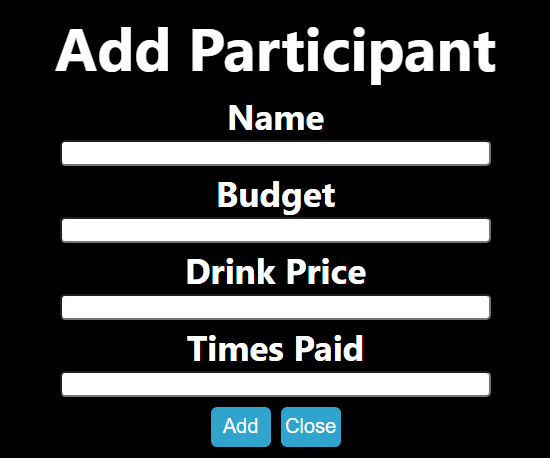

# Coffee Crisis

Submission for Berthand Labs Coding Challenge.

<!-- ABOUT THE PROJECT -->
## About The Project

This website uses a simple interface to help you decide who should pay for everyone's coffee. 

### Prerequisites and Installation
You will need node and npm installed globally on your machine.

1. Clone this repository.

2. Open the repository with your code editor of choice and run:
```sh
cd my-app
npm run install
npm start
```

### Executing program

1. Once you run npm start, you can interact with the program in your browser.
2. To add a participant, click the ADD button and input the participant's data, which includes their name, budget, the price of their chosen drink, and how many times they have paid in the past. If no data or invalid input is given for a specific value, then default values will be used (empty string for strings and 0 for numbers). 



3. To remove a participant, you can click on their information in the participant's list.
4. Once you are ready, you can click on the pay button to view the results.

### Assumptions
This program assumes the following:
1. If a person buys a more expensive drink, then they should be more likely to pay.
2. If a person has more money, then they should be slightly more likely to pay.
3. A person who has paid more times in the past should have a lower chance of paying.

This program encodes these assumptions in a score function. Each participant will receive a score via this function, and then the participant with the greatest score should pay. To break ties, a coin flip is used.
